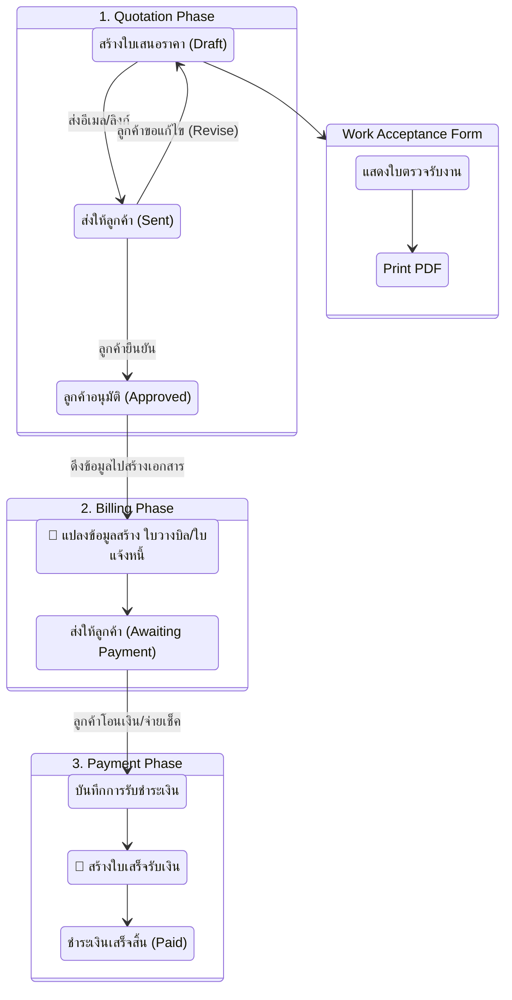

```mermaid
stateDiagram-v2
	direction TB

	%% Quotation Phase
	state "1. Quotation Phase" as QPhase {
		DraftQ: สร้างใบเสนอราคา (Draft)
		SentQ: ส่งให้ลูกค้า (Sent)
		ApprovedQ: ลูกค้าอนุมัติ (Approved)
		DraftQ --> SentQ: ส่งอีเมล/ลิงก์
		SentQ --> ApprovedQ: ลูกค้ายืนยัน
		SentQ --> DraftQ: ลูกค้าขอแก้ไข (Revise)
	}

	DraftQ --> WAF

	%% Work Acceptance Form
	state "Work Acceptance Form" as WAF {
		ShowWAF: แสดงใบตรวจรับงาน
		PrintWAF: Print PDF
		ShowWAF --> PrintWAF
	}

	%% Billing Phase
	state "2. Billing Phase" as BPhase {
		CreateInv: 🔄 แปลงข้อมูลสร้าง ใบวางบิล/ใบแจ้งหนี้
		SentInv: ส่งให้ลูกค้า (Awaiting Payment)
		CreateInv --> SentInv
	}

	%% Payment Phase
	state "3. Payment Phase" as PPhase {
		RecordPay: บันทึกการรับชำระเงิน
		IssueReceipt: 🔄 สร้างใบเสร็จรับเงิน
		Paid: ชำระเงินเสร็จสิ้น (Paid)
		RecordPay --> IssueReceipt
		IssueReceipt --> Paid
	}

	ApprovedQ --> CreateInv: ดึงข้อมูลไปสร้างเอกสาร
	SentInv --> RecordPay: ลูกค้าโอนเงิน/จ่ายเช็ค
```