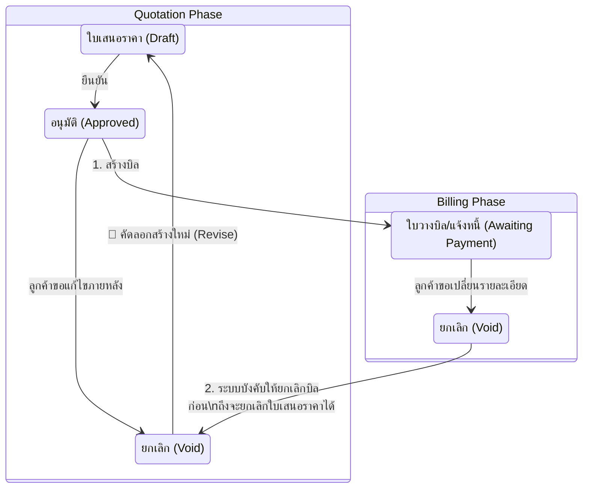

```mermaid
stateDiagram-v2
	direction TB

	state "Quotation Phase" as QPhase {
		DraftQ: ใบเสนอราคา (Draft)
		ApprovedQ: อนุมัติ (Approved)
		VoidQ: ยกเลิก (Void)

		DraftQ --> ApprovedQ : ยืนยัน
		ApprovedQ --> VoidQ : ลูกค้าขอแก้ไขภายหลัง
		VoidQ --> DraftQ : 🔄 คัดลอกสร้างใหม่ (Revise)
	}

	state "Billing Phase" as BPhase {
		SentInv: ใบวางบิล/แจ้งหนี้ (Awaiting Payment)
		VoidInv: ยกเลิก (Void)

		SentInv --> VoidInv : ลูกค้าขอเปลี่ยนรายละเอียด
	}

	ApprovedQ --> SentInv : 1. สร้างบิล
	VoidInv --> VoidQ : 2. ระบบบังคับให้ยกเลิกบิลก่อน\nถึงจะยกเลิกใบเสนอราคาได้
```